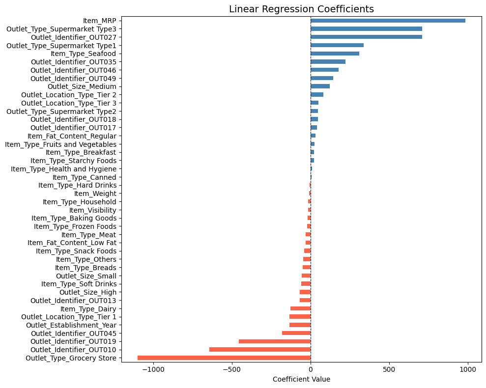
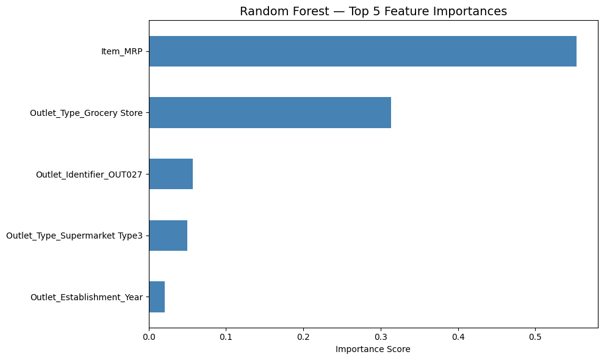

# Prediction of Product Sales

**Author:** Insaf AlRumi

---

## Project Overview

This project analyzes retail sales data across various outlet types and product categories to identify the key factors that drive sales performance. Using exploratory data analysis and machine learning, the goal is to build a reliable model that predicts item outlet sales — enabling retailers to make smarter, data-driven decisions around inventory, pricing, and store operations.

**Dataset:** 8,523 products across multiple retail outlets  
**Target Variable:** `Item_Outlet_Sales` — the sales revenue of a product at a given store

---

## Data Source

[Big Mart Sales Dataset](https://datahack.analyticsvidhya.com/contest/practice-problem-big-mart-sales-iii/)

---

## EDA Insights

### 1. Sales Distribution is Right-Skewed


The majority of products generate sales between **$0 and $2,000**, while only a small number of high-performing items exceed $8,000. This right-skewed distribution suggests that a few top products contribute disproportionately to total revenue — a pattern retailers should factor into their stocking and promotion strategies.

---

### 2. Item Price (MRP) is the Strongest Predictor of Sales


A moderate positive correlation **(r = 0.57)** was found between a product's Maximum Retail Price and its outlet sales. Higher-priced items tend to generate more revenue, confirming that pricing strategy plays a central role in sales performance.

---

### 3. Most Features Show Weak Correlation with Sales


The correlation heatmap confirms that `Item_MRP` is the only numeric feature with a meaningful relationship to sales (r = 0.57). Features such as `Item_Visibility` (r = -0.13) and `Item_Weight` (r = -0.06) show very weak correlations — suggesting that categorical features like outlet type carry more predictive power than raw numeric measurements.

---

## Model & Evaluation

Two models were trained and evaluated to predict `Item_Outlet_Sales`:

| Model | Train R² | Test R² | Test RMSE |
|---|---|---|---|
| Linear Regression | 0.562 | 0.567 | $1,092.86 |
| Random Forest (default) | 0.937 | 0.559 | $1,097.67 |
| Random Forest (tuned) | 0.716 | 0.590 | $1,069.00 |

### Recommended Model: Linear Regression

The Linear Regression model is recommended for this use case. It demonstrates the most **consistent and balanced performance** — with nearly identical training and test scores, indicating minimal overfitting.

**In plain terms:** The model explains approximately **57% of the variation in product sales**. When it makes an error, it is off by roughly **$1,093 on average**.

---

## Model Explainability

### Linear Regression — Coefficients



The coefficients show how much each feature increases or decreases the predicted sales value, while holding all other features constant.

**Top 3 Most Impactful Features:**

| Feature | Direction | Interpretation |
|---|---|---|
| `Item_MRP` | ➕ Positive (~+1000) | Every unit increase in price is associated with approximately $1,000 more in predicted sales — the single strongest driver in the model |
| `Outlet_Type_Grocery Store` | ➖ Negative (~-1300) | Products sold in Grocery Stores are predicted to generate roughly $1,300 less in sales compared to other outlet types |
| `Outlet_Type_Supermarket Type3` | ➕ Positive (~+650) | Products in Supermarket Type 3 outlets are predicted to earn approximately $650 more than the baseline outlet type |

**Key takeaway:** Outlet type and item price are the two dominant forces shaping sales predictions. Products in Grocery Stores consistently underperform, while Supermarket Type 3 locations drive the highest sales.

---

### Random Forest — Feature Importances



Feature importance scores show how much each feature contributed to reducing prediction error across all decision trees in the model.

**Top 5 Most Important Features:**

| Rank | Feature | Importance | Interpretation |
|---|---|---|---|
| 1 | `Item_MRP` | ~0.56 | By far the most important feature — accounts for over half of the model's predictive power |
| 2 | `Outlet_Type_Grocery Store` | ~0.31 | Being a Grocery Store is the second strongest signal — these outlets have distinctly lower sales patterns |
| 3 | `Outlet_Identifier_OUT027` | ~0.05 | This specific outlet performs notably differently from others |
| 4 | `Outlet_Type_Supermarket Type3` | ~0.05 | Supermarket Type 3 locations show a distinct sales pattern the model has learned to recognize |
| 5 | `Outlet_Establishment_Year` | ~0.02 | Outlet age has a small but measurable effect on sales |

**Key takeaway:** Both models agree — `Item_MRP` and outlet type are the two most critical factors in predicting product sales. The Random Forest confirms this finding independently through a completely different algorithmic approach.

---

## Final Recommendations

Based on the analysis and model results, the following recommendations are made for retail stakeholders:

1. **Prioritize pricing strategy.** Item MRP is the single strongest predictor of sales in both models. Retailers should carefully evaluate their pricing tiers, as higher-priced products consistently drive more revenue.

2. **Differentiate strategy by outlet type.** Grocery Stores significantly underperform compared to Supermarkets — particularly Supermarket Type 3. Retailers managing multiple outlet formats should tailor their inventory and promotional strategies per outlet type rather than applying a one-size-fits-all approach.

3. **Invest in high-performing outlets.** Specific outlets (e.g., OUT027) show outsized sales performance. Identifying what makes these locations successful and replicating those conditions elsewhere could meaningfully improve overall revenue.

4. **Revisit visibility and weight data quality.** These features showed near-zero correlation with sales, which may reflect data quality issues (e.g., the zero-visibility values addressed during preprocessing) rather than a true lack of relationship. Improving data collection for these fields could unlock additional predictive signal in future models.

---

## Repository Structure

```
├── prediction_of_product_sales.ipynb   # Full analysis notebook
├── images/
│   ├── sales_distribution.png
│   ├── mrp_vs_sales.png
│   ├── correlation_heatmap.png
│   ├── lrc.png
│   └── rf5.png
└── README.md
```

---

## Tools & Libraries

- Python, Pandas, NumPy
- Matplotlib, Seaborn
- Scikit-learn (LinearRegression, RandomForestRegressor, GridSearchCV)
