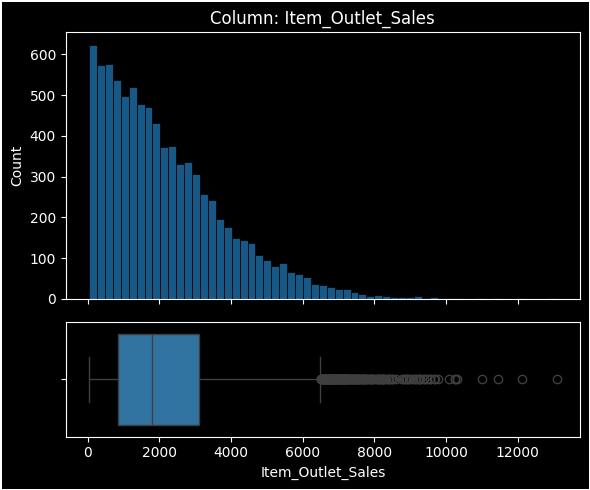
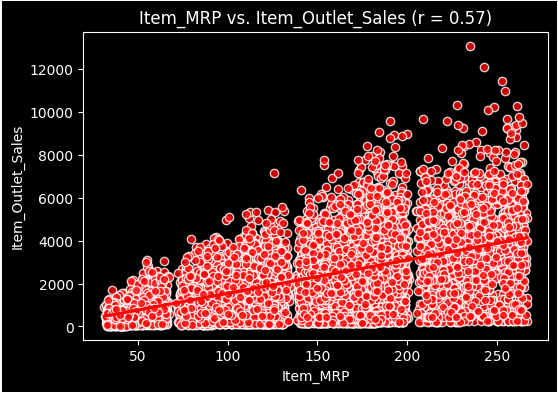
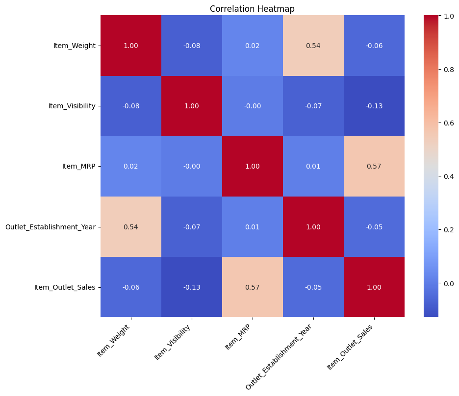

# Prediction of Product Sales
 
**Author:** Insaf AlRumi
 
---
 
## Project Overview
 
This project analyzes retail sales data across various outlet types and product categories to identify the key factors that drive sales performance. Using exploratory data analysis and machine learning, the goal is to build a reliable model that predicts item outlet sales — enabling retailers to make smarter, data-driven decisions around inventory, pricing, and store operations.
 
**Dataset:** 8,523 products across multiple retail outlets  
**Target Variable:** `Item_Outlet_Sales` — the sales revenue of a product at a given store
 
---
 
## Data Source
 
[Big Mart Sales Dataset](https://datahack.analyticsvidhya.com/contest/practice-problem-big-mart-sales-iii/)
 
---
 
## EDA Insights
 
### 1. Sales Distribution is Right-Skewed
 

 
The majority of products generate sales between **$0 and $2,000**, while only a small number of high-performing items exceed $8,000. This right-skewed distribution suggests that a few top products contribute disproportionately to total revenue — a pattern retailers should factor into their stocking and promotion strategies.
 
---
 
### 2. Item Price (MRP) is the Strongest Predictor of Sales
 

 
A moderate positive correlation **(r = 0.57)** was found between a product's Maximum Retail Price and its outlet sales. Higher-priced items tend to generate more revenue. This was the strongest numeric relationship found in the dataset, confirming that pricing strategy plays a central role in sales performance.
 
---
 
### 3. Most Features Show Weak Correlation with Sales
 

 
The correlation heatmap confirms that `Item_MRP` is the only numeric feature with a meaningful relationship to sales (r = 0.57). Other features such as `Item_Visibility` (r = -0.13) and `Item_Weight` (r = -0.06) show very weak or negligible correlations — suggesting that categorical features like outlet type play a more important role than raw numeric measurements.
 
---
 
## Model & Evaluation
 
Two models were trained and evaluated to predict `Item_Outlet_Sales`:
 
| Model | Train R² | Test R² | Test RMSE |
|---|---|---|---|
| Linear Regression | 0.562 | 0.567 | $1,092.86 |
| Random Forest (default) | 0.937 | 0.559 | $1,097.67 |
| Random Forest (tuned) | 0.716 | 0.590 | $1,069.00 |
 
### Recommended Model: Linear Regression
 
The Linear Regression model is recommended for this use case. Although the tuned Random Forest achieved a slightly higher test R², the Linear Regression model demonstrates the most **consistent and balanced performance** — with nearly identical training and test scores, indicating minimal overfitting.
 
**In plain terms:** The model explains approximately **57% of the variation in product sales**. When it makes an error, it is off by roughly **$1,093 on average** — a reasonable margin for business planning purposes.
 
---
 
## Repository Structure
 
```
├── prediction_of_product_sales.ipynb   # Full analysis notebook
├── images/
│   ├── sales_distribution.png
│   ├── mrp_vs_sales.png
│   └── correlation_heatmap.png
└── README.md
```
 
---
 
## Tools & Libraries
 
- Python, Pandas, NumPy
- Matplotlib, Seaborn
- Scikit-learn (LinearRegression, RandomForestRegressor, GridSearchCV)
